_extracting-data-tables

Extracting data tables from query results
=========================================

VAMDC nodes return data in XSAMS format, which is rich in metadata and good for self-describing results. For onward processing, extracting some of the XSAMS content in a table is more useful, and there are several ways to do this.

Task 1: capture a line list using the general XSAMS-viewer
----------------------------------------------------------

Using the web portal, query for a spectral range (delimited in wavelength, frequency, etc.). Choose a node that gave some results and display them in the XSAMS tabulator. Save the line list as a *.csv* file and open it in your favourite spreadsheet.

**Relevant sections of user guide:** http://voparis-twiki.obspm.fr/twiki/bin/view/VAMDC/PortalUserGuide#Query, http://voparis-twiki.obspm.fr/twiki/bin/view/VAMDC/PortalUserGuide#Query_Results http://voparis-twiki.obspm.fr/twiki/bin/view/VAMDC/PortalUserGuide#XSAMS_Processors

**Expected results**: for a wavelength region from 5005 to 5010 Angstrom, the VALD results look like this in the viewer:

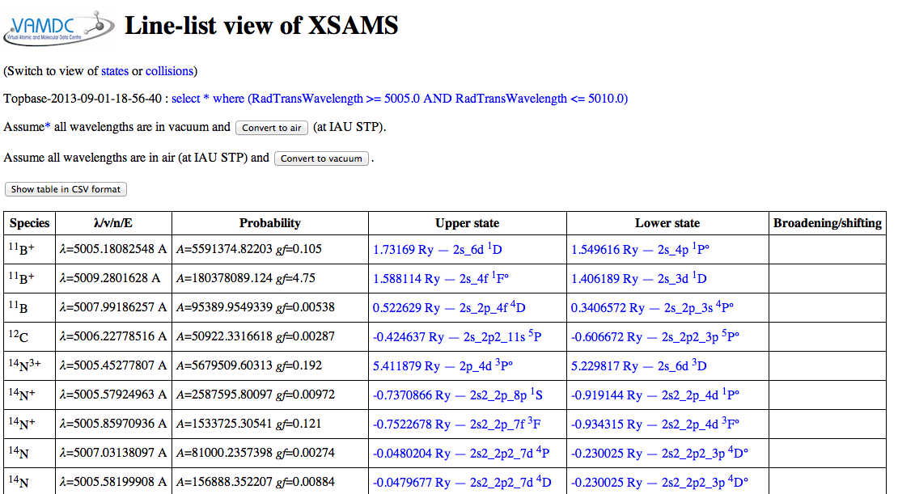

The convert-to-CSV button on that page turns them into this:

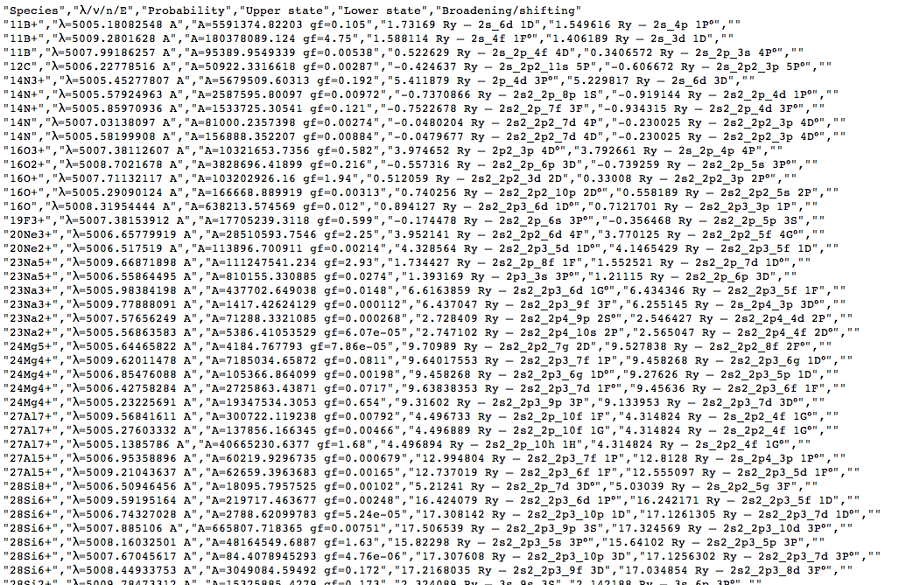

This page in the browser can be saved to local disc (give it a name ending in *.csv* to improve the chance of local tools recognising the type of data) and opened in a spreadsheet:

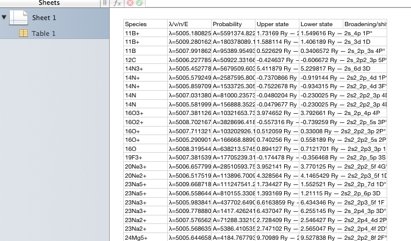

Note that the column names are preserved when the data are saved as *.csv*. The columns are formatted as in the viewer application that wrote the file. This is useful if you want an exact copy of what you viewed, but not ideal if you want to apply formulae to the values; the supporting text gets in the way. All tables available in this viewer, covering most of XSAMS, can be saved in this way.

Task 2: capture a line list using the dedicated viewer for atomic spectroscopy
------------------------------------------------------------------------------

Using the web portal query for a range of wavelength, as in task 1. Choose from the results page one of the atomic-spectroscopy database (*not* molecular spectroscopy as the tool demonstrated in this task doesn't handle molecular data). Display and capture the line list as in task 1, but this time use the special processor for atomic data.

**Expected results:** for the query described in task 1, the display now looks like this:

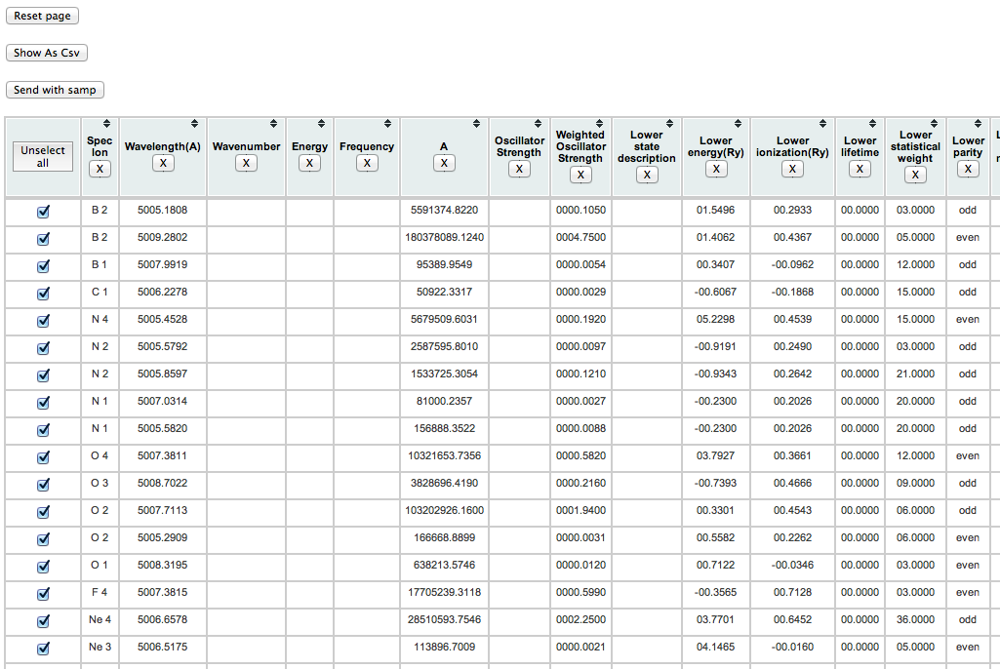

(note that each datum is in a separate column), and after conversion to *.csv*, like this:

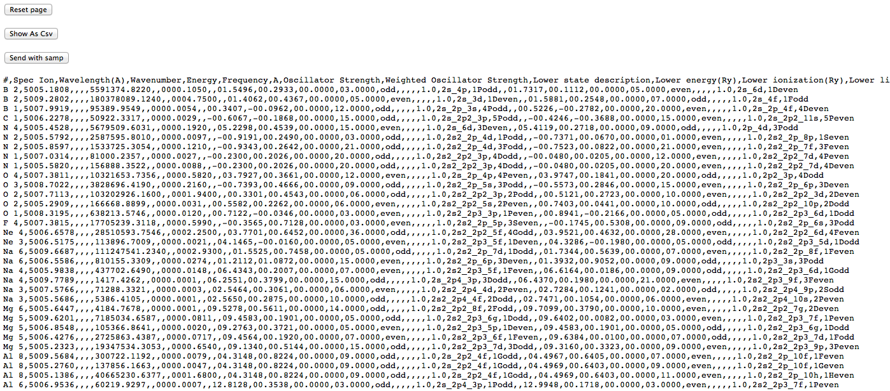

This latter view is actually the CSV contents displayed inside a web-page (note that the buttons at the top remain), so saving it directly doesn't give a proper *.csv* file. One can either copy and paste the CSV part into an empty text file, or save the web page and prune off the HTML wrapping the CSV. This allow the data to be loaded into a proper spreadsheet with sensible columns:

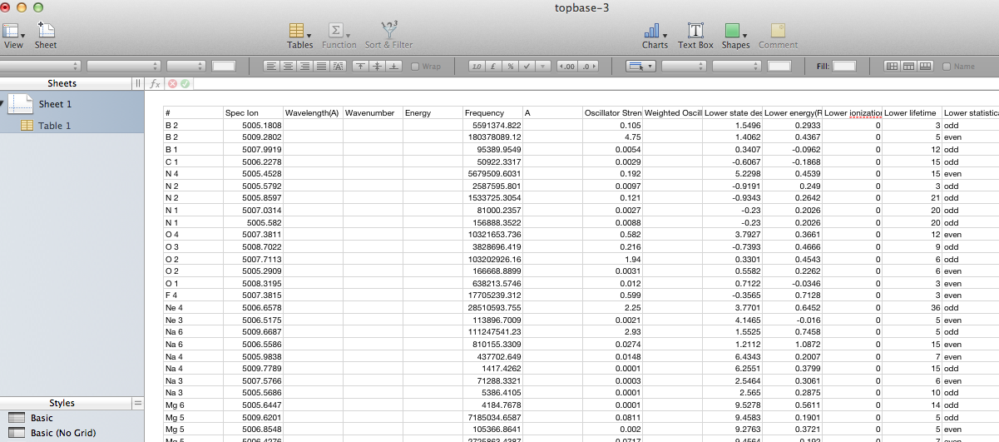
  
The last functionnality provided by the page is the possibility to send data from this html table to another application thanks to the `Simple Application Message Protocol <http://www.ivoa.net/documents/SAMP/>`_ (Samp)

This protocol from the International Virtual Observatory Alliance allows direct data exchange between applications without saving and reloading data. In our case the data exchange is done thanks to a 
file format called `VOTable <http://www.ivoa.net/documents/VOTable/20130315/PR-VOTable-1.3-20130315.html>`_ (data contained in the html table are converted to a VOTable and sent to another application).

To illustrate the process, we will send data to an application called `Topcat <http://www.star.bris.ac.uk/~mbt/topcat/#intro>`_. If it is already available on your computer, simply launch it. 
If it is not the case, you can get it from `here <http://www.star.bris.ac.uk/~mbt/topcat/#standalone>`_  

At startup, Topcat automatically launches a Samp Hub that will listen to messages from other applications.

Choose all lines related to Ar 3 ion. Then click on the "Send with samp" button on the page. 

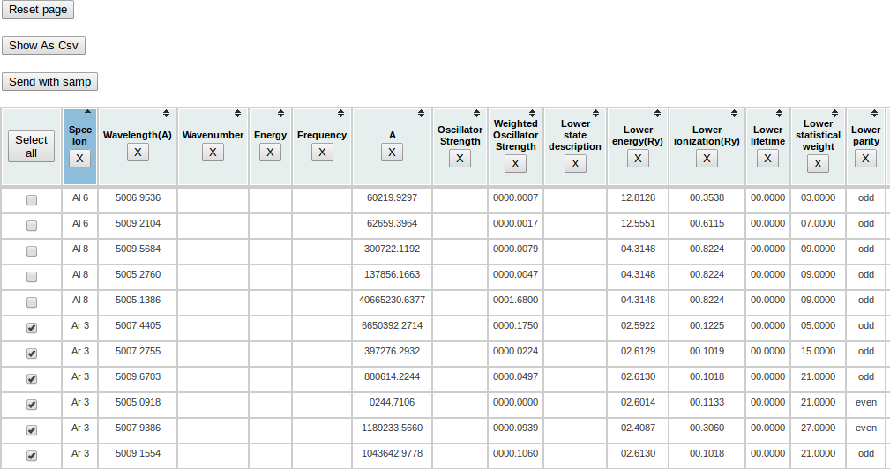

A warning message will appear, you can click "Yes" (or "Oui" on this window in French :) ). 

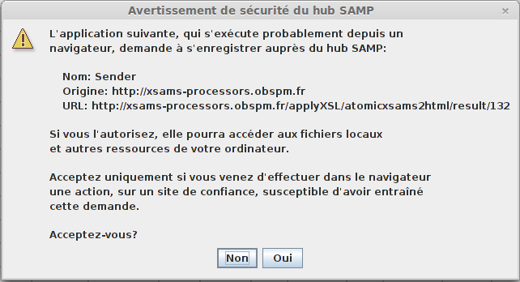

A file containing all selected lines will be sent to Topcat which provides a great set of data manipulation features. 

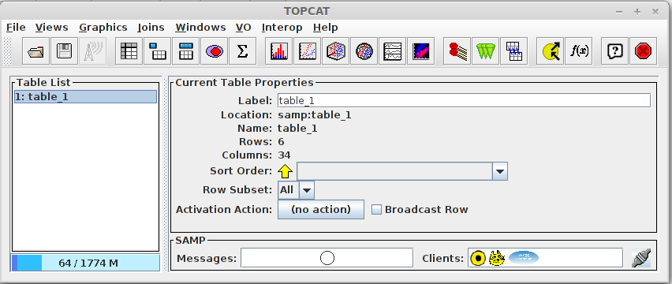

Task 3: extract collision data with the dedicated processor
-----------------------------------------------------------

Using the web portal, query for collisions between Hydrogen atoms and Carbon-Monoxide molecules. Select the results from BASECOL, convert one of the rate-coefficient tables to CSV format and open it in a spreadsheet. You should use the dedicated XSAMS-processor labelled "collision data-sets as CSV". Repeat the exercise for the KIDA results.

**Expected results:** there should be about 15 collisions in the BASECOL results. When you load them into the processor, it shows a list of collisions, with links to the data-sets, like this:

.. image::
  basecol-collisions-csv-1.png
  :alt: collision list from BASECOL results.

Note that each collision contains discreet data-tables. This differs from the line-list exercises, above, where each line appears as a row within a single table.

Following the link to one of the table reveals the CSV representation:

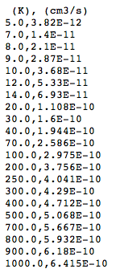

There are column headers (although BASECOL gives only the units not the names for the columns), and the other cells are numbers unencumbered by legends. The table can be downloaded using the "save-page-as" command in the browser. It can then be opened and used in a spreadsheet.

There should be several hundred collision in the KIDA results (and they take a little longer to download!). When the processor displays the collisions, you will see that the data are represented as fitted functions, not tables and the processor cannot handle this (at least in the current version; various upgrades are planned). There is currently no way to extract these data.

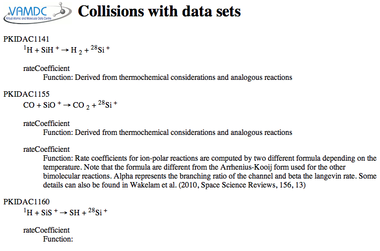
