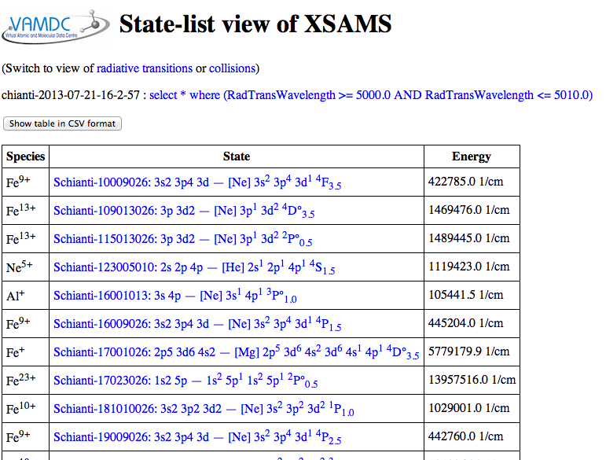
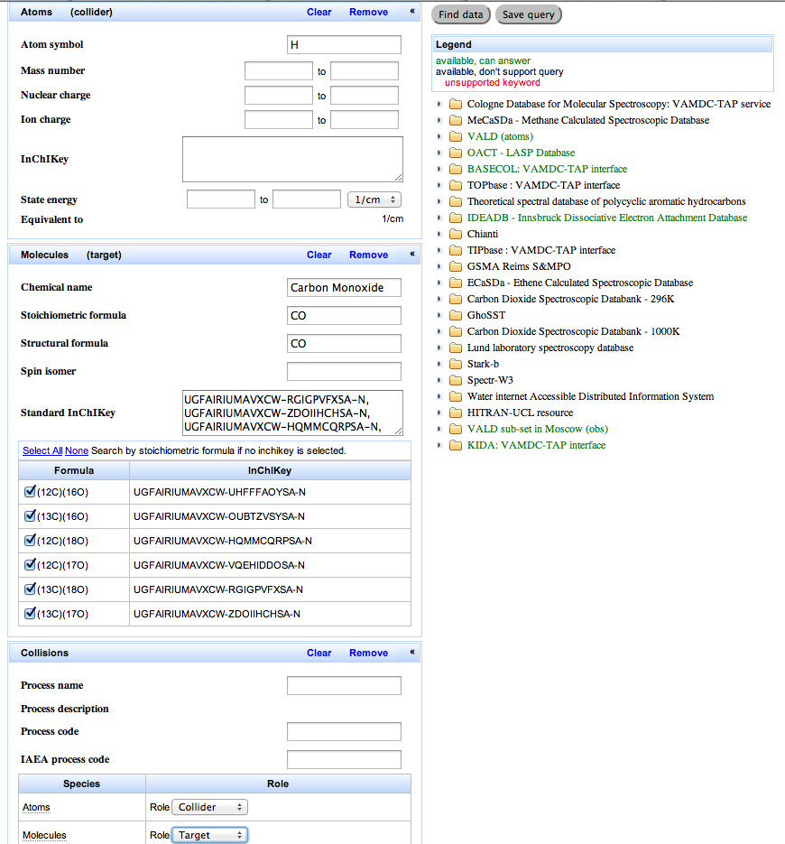
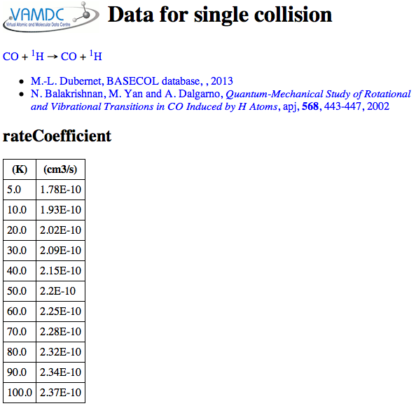

_first-steps-with-portal

First steps with the VAMDC web-portal
=====================================

The VAMDC web-portal is the best place for new users to approach the system. It is a web-site that allows you to query all the databases in VAMDC.

Task 1: find the right portal
-----------------------------

With a web browser [#f1]_, go to the page http://portal.vamdc.eu/ (http://portal.vamdc.org/ is the same place). You will see a simple entry-page with links to three [#f2]_ separate portals. One is released for external users (such as yourself) and the others are for VAMDC testing. Follow the links to all three portals and compare the results.

**Expected results:** the "development" portal asks for a password which you do not have. This portal is not available at all to end users. The others show you nearly identical welcome pages like this:

.. image::
   portal-welcome.png
   :alt: portal's welcome page 

The number of available databases differs between the portals: the test versions have more. This reflects the fact that the different portals *lead to different versions of the VAMDC system* with different data linked in. For consistency of results, make sure that you always use the released version of the portal. [#f3]_ All the subsequent tasks assume that you use the released portal.

Task 2: investigate the available databases
-------------------------------------------

On the welcome page of the portal, find the link to the list of databases. Note the descriptions of the kinds of data on that page and explore the links to the longer descriptions. Identify the databases that specialise in molecular spectroscopy.

**Relevant section of user guide:** http://voparis-twiki.obspm.fr/twiki/bin/view/VAMDC/PortalUserGuide#VAMDCDatabases

**Expected results**: the list of databases looks something like this:

.. image::
  portal-database-list.png
  :alt: (part of) portal's database list

These databases deal with molecular spectroscopy: CDMS, MeCaSDa, OACT-LASP, Cagliari/Toulouse PAH, S&MPO, ECaSDa, CDSD, WADIS, HITRAN. Note that you have to follow the per-database links to find this out for some of the entries.

The information is structured around the set of distinct databases contributed to VAMDC by data providers. This structure appears throughout VAMDC: there is no single database for "spectroscopy".

You might see more molecular-spectroscopy databases than listed above. This reflects that fact that VAMDC is dynamic. Databases can be added to the system at any time. [#f4]_

Task 3: find some spectroscopic data
------------------------------------

From the portal's welcome page, follow the link to the query page. Enter a query on wavelength, specifying a wavelength range of 5000 to 5010 Angstroms. [#f5]_ (Hint: constraints on spectral region are in the "processes" menu.) Observe how the other information on the page changes as you enter the search terms. Submit the search (hint: use the "find data button; the "save query button isn't relevant here) and note the results; identify the databases that have data for this search.

**Relevant section of user guide:** http://voparis-twiki.obspm.fr/twiki/bin/view/VAMDC/PortalUserGuide#Query

**Expected results:** the query page looks like this before you submit the search:

.. image::
   portal-query-form-spectro-example.png
   :alt: portal's query page showing a simple search for spectroscopic data

The list to the right of the search form is a list of databases registered in VAMDC. Those that are available [#f6]_ and which understand the search term are highlighted in green.

When you submit the search, the portal comes back quickly with a page that looks like this:

.. image::
   portal-query-result-spectro-example.png
   :alt: portal's results page showing a simple search for spectroscopic data

When you first see this page, the search is still in progress: there is a progress bar at the top of the page. The page updates as each database reports its results. The whole search should complete within one minute.

The main part of the page is a table of results for each database queried, listing the number of species, lines etc. found in the search. There should be one row for each of the databases highlighted in the query form: the search only includes the databases which the portal knows to understand the search term. [#f7]_

The response column states "OK" or "EMPTY" or "TRUNCATED" or "FAIL" for each database searched. "OK" means data are available. "EMPTY" means that no data match the search term. "TRUNCATED" means that many data are available from the search and the database is declining to give you all of them in one go. You can either get the indicated percentage of the results, or refine your query to match fewer results (e.g. by reducing the spectral range, or by limiting to particular emitting species). "FAIL" means that something broke within the system: this is not your fault! You should report failures to VAMDC for correction.

At this point, no data have actually been extracted from the databases. Only counts of things have been collected. Therefore the search is relatively quick, even when huge volumes of data match the search terms. Actually getting the data is the next task.

Task 4: view the data found in a search
---------------------------------------

View the search results from the previous task are fine for this task).
Select the Chianti results from the table (hint; use the checkbox at the start of the Chianti row), and no others, and send them to the "XSAMS processor"" for viewing results as tables. Investigate the available information on the states and lines.

**Relevant section of user guide:** http://voparis-twiki.obspm.fr/twiki/bin/view/VAMDC/PortalUserGuide#XSAMS_Processors

**Expected results:** The processor gives you a page, opening in a new tab or window of the browser, looking like this:

The "XSAMS processors" are services associated with the portal [#f8]_ that transform the results from VAMDC's common, machine-readable format (XSAMS) into other forms. This particular processor tries to display in the browser "all" [#f9]_ the data and metadata.

The first page of results tabulate the atomic states. From here you can look at details of each state, or switch to a view of lines or collisions; from those pages, you can get details of individual lines and collisions. [#f10]_

Task 5: find some data on atom-molecule collisions
--------------------------------------------------

Go to the query page of the portal. Enter a search where the target is a carbon monoxide molecule (all isotopologues) and the collider is a hydrogen atom (hint: you need to enter the two reactants from the species menu and then assign the roles from the processes/collisions menu; you don't need to specify any code for the kind of collision). Submit the query and from the results, select and view the Basecol results and then the Kida results.

**Relevant section of user guide:** http://voparis-twiki.obspm.fr/twiki/bin/view/VAMDC/PortalUserGuide#Query

**Expected results:** the completed search-form looks like this:

As you enter the identity of the molecule, the portal suggest a list of possible matches. When you select one of the matches, the portal then suggests a list of isotopologues for that molecule. You can select all isotopologues or a sub-set. [#f11]_

In the data viewer, you should look at the collisions list and from there, the information for a single collision. You will find, for Basecol, a table of rate coefficients, like this:

or, for Kida, alegbraic fits to the rate coefficients like this:

.. image::
   collision-view-kida-example.png
   :alt: Data for a single collision extracted from Kinda via the portal and XSAMS viewer.

Whereas spectroscopic data from VAMDC can be well represented in one row of a table per line, the collision data have one or more complete 2D data-sets per collision. Kida includes alternate functions for the rate coefficient from different sources.

Task 6: downloading the data
----------------------------

Execute a search in the portal (the results from any of the previous tasks will suit). Download the results in XSAMS format and inspect them.

**Relevant section of user guide:** http://voparis-twiki.obspm.fr/twiki/bin/view/VAMDC/PortalUserGuide#Query_results_table 

**Expected results:** the downloaded data are in XSAMS format, which is a dialect of XML.
If you look at the XSAM file in a text editor, the start looks like this::

   <?xml version="1.0" encoding="UTF-8" standalone="yes"?><XSAMSData xmlns="http://vamdc.org/xml/xsams/0.3"   
   xmlns:cml="http://www.xml-cml.org/schema" xmlns:asymcs="http://vamdc.org/xml/xsams/0.3/cases/asymcs"
   xmlns:asymos="http://vamdc.org/xml/xsams/0.3/cases/asymos" xmlns:dcs="http://vamdc.org/xml/xsams/0.3/cases/dcs"
   xmlns:gen="http://vamdc.org/xml/xsams/0.3/cases/gen" xmlns:hunda="http://vamdc.org/xml/xsams/0.3/cases/hunda"
   xmlns:hundb="http://vamdc.org/xml/xsams/0.3/cases/hundb" xmlns:lpcs="http://vamdc.org/xml/xsams/0.3/cases/lpcs"
   xmlns:lpos="http://vamdc.org/xml/xsams/0.3/cases/lpos" xmlns:ltcs="http://vamdc.org/xml/xsams/0.3/cases/ltcs"
   xmlns:ltos="http://vamdc.org/xml/xsams/0.3/cases/ltos" xmlns:nltcs="http://vamdc.org/xml/xsams/0.3/cases/nltcs"
   xmlns:nltos="http://vamdc.org/xml/xsams/0.3/cases/nltos" xmlns:sphcs="http://vamdc.org/xml/xsams/0.3/cases/sphcs"
   xmlns:sphos="http://vamdc.org/xml/xsams/0.3/cases/sphos"
   xmlns:stcs="http://vamdc.org/xml/xsams/0.3/cases/stcs"><Species><Atoms><Atom><ChemicalElement><NuclearCharge>1</NuclearCharge><ElementSymbol>H</ElementSymbol> ...

which is not particularly readable. With line breaks added, it looks like this::

   <?xml version="1.0" encoding="UTF-8" standalone="yes"?>
   <XSAMSData xmlns="http://vamdc.org/xml/xsams/0.3" xmlns:cml="http://www.xml-cml.org/schema"
     xmlns:asymcs="http://vamdc.org/xml/xsams/0.3/cases/asymcs"
     xmlns:asymos="http://vamdc.org/xml/xsams/0.3/cases/asymos"
     xmlns:dcs="http://vamdc.org/xml/xsams/0.3/cases/dcs"
     xmlns:gen="http://vamdc.org/xml/xsams/0.3/cases/gen"
     xmlns:hunda="http://vamdc.org/xml/xsams/0.3/cases/hunda"
     xmlns:hundb="http://vamdc.org/xml/xsams/0.3/cases/hundb"
     xmlns:lpcs="http://vamdc.org/xml/xsams/0.3/cases/lpcs"
     xmlns:lpos="http://vamdc.org/xml/xsams/0.3/cases/lpos"
     xmlns:ltcs="http://vamdc.org/xml/xsams/0.3/cases/ltcs"
     xmlns:ltos="http://vamdc.org/xml/xsams/0.3/cases/ltos"
     xmlns:nltcs="http://vamdc.org/xml/xsams/0.3/cases/nltcs"
     xmlns:nltos="http://vamdc.org/xml/xsams/0.3/cases/nltos"
     xmlns:sphcs="http://vamdc.org/xml/xsams/0.3/cases/sphcs"
     xmlns:sphos="http://vamdc.org/xml/xsams/0.3/cases/sphos"
     xmlns:stcs="http://vamdc.org/xml/xsams/0.3/cases/stcs">
     <Species>
       <Atoms>
         <Atom>
           <ChemicalElement>
             <NuclearCharge>1</NuclearCharge>
             <ElementSymbol>H</ElementSymbol>
           </ChemicalElement>
           <Isotope>
             <IsotopeParameters>
               <MassNumber>1</MassNumber>
               <Mass>
                 <Value units="amu">1.00783</Value>
               </Mass>
             </IsotopeParameters>
             <Ion speciesID="XBAS8">
               <IonCharge>0</IonCharge>
               <AtomicState stateID="SBASET57-1">
                 <Comments>Energy level of H (no structure)</Comments>
                 <SourceRef>BBAS0</SourceRef>
                 <AtomicNumericalData>
                   <StateEnergy>
                     <Value units="1/cm">0.0</Value>
                   </StateEnergy>
                 </AtomicNumericalData>
                 <AtomicQuantumNumbers>
                   <TotalAngularMomentum>0.0</TotalAngularMomentum>
                 </AtomicQuantumNumbers>
                 <AtomicComposition>
                   <Component>
                     <Term>
                       <LS>
                         <L>
                           <Value>0</Value>
                           <Symbol>L</Symbol>
                         </L>
                         <S>0.0</S>
                       </LS>
                     </Term>
                   </Component>
                 </AtomicComposition>
               </AtomicState>
               <InChIKey>YZCKVEUIGOORGS-UHFFFAOYSA-N</InChIKey>
             </Ion>
           </Isotope>
         </Atom>
       </Atoms>
      ...

which is better but still not comfortable to read. XSAMS is VAMDC's exchange format for moving data between applications and it is not optimised for human viewing. (If you need to read it yourself, the XSAMS viewer from the earlier task of this exercise is your friend.) You might download the XSAMS if you have local software that reads the format; if you plan to upload the data to an on-line service that reads XSAM; or if you want to archive your search results in a self-describing form.

.. rubric:: Footnotes

.. [#f1] Any recent browser should work with VAMDC portal. You must have Javascript, but not Java, enabled in the browser; this is how most browsers are set by default.

.. [#f2] Depending on the state of development, there might be fewer than three portals. There will always be at least one, and normally at least two.

.. [#f3] When there is an unlocked portal for testing, you are free to use it. However, beware of changes in both the system software and the underlying data: this test system may be using newer versions of the databases.

.. [#f4] VAMDC sometimes gains major features such as new databases across system releases, but databases are more likely to be added to an already-released system.

.. [#f5] The default search term for spectral region is wavelength in Angstroms because many of the builders and early users of VAMDC are Astrophysicists. You can search on frequency, wavenumber or photon energy instead, if you wish, and you can use different units.

.. [#f6] "Registered" means that the database is known to VAMDC and usually accessible. "Available" means that the VAMDC node that gives access to the database is actually working at present.

.. [#f7] The exact query sent to each database is shown at the top of the results page, near the progress bar. It is sometimes useful to write this down for future reference, although we wont need that information in the current exercise.

.. [#f8] These services work with the portal but are not structurally part of it. This means that you can use them separately from the portal; but that is an advanced usage and not part of this exercise.

.. [#f9] XSAMS is rich in metadata and flexible, so displaying all the information for every case is challenging. The current viewer doesn't get all of it, but is upgraded occasionally to be more complete. If you find that the display is missing something of importance to you, raise an issue with VAMDC support.

.. [#f10] In the current example, the Chianti data-extract has line data but nothing on collisions (Chianti's excitation tables should show up here but sadly have not yet been added to the Chianti node.) The collisions page is reachable but contains an empty table.

.. [#f11] This matching of identifies for species is done using a local database of species built into the portal, essentially a union of all the species known to all the VAMDC nodes. The content of that database is also available as a specialised VAMDC node that know of species but not lines or collisions. In advanced uses, you can query that database directly, but this trick is not explored in the current exercise.