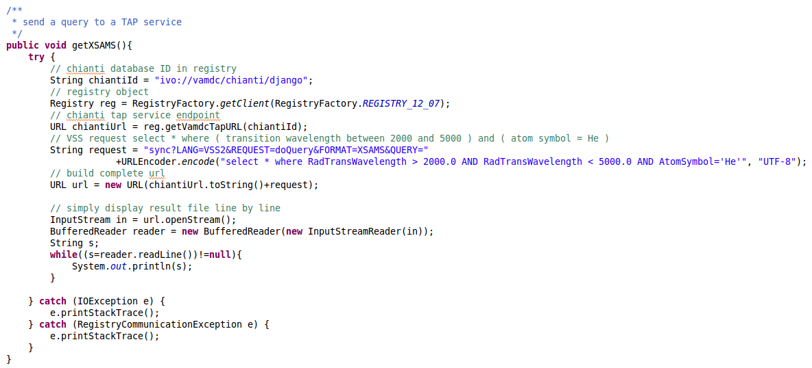
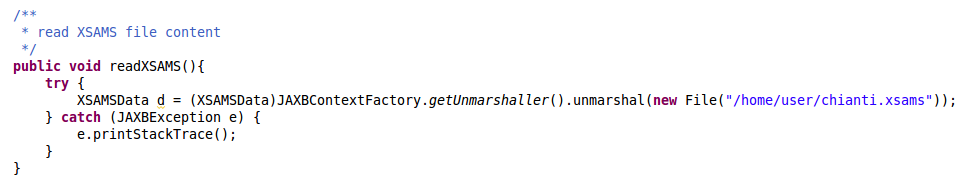
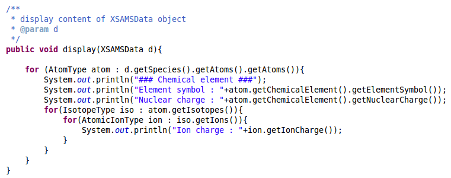

Using VAMDC Java libraries
==========================

Presentation
------------

In order to provide a direct programmatic access to its infrastructure, VAMDC provides some java libraries : 

 - xsams.jar : java classes mapping the XSAMS schema
 - xsams-io.jar : XSAMS document marshalling and unmarshalling 
 - registry-client-light.jar : querying the registry
 
 
To complete this tutorial you will have to download the required libraries : 
 - `xsams.jar and xsams-io.jar <http://lerma.obspm.fr/adass/archives/xsams.tar.gz>`_.
 - `registry-client-light.jar <http://lerma.obspm.fr/adass/archives/registry.tar.gz>`_.
 
The complete code for this tutorial is available `here <http://lerma.obspm.fr/adass/archives/Tutorial.java>`_ (but it is better if you read it later).

Task 1 : Querying the registry
------------------------------

To query the registry, the main library is called registry-client-light-12.07.jar. This is a high level library hiding most of what is happening.
To get it running, you will have to include all the other jars provided in the 2 archives above.

This library provides a `RegistryFactory <http://lerma.obspm.fr/adass/javadoc/registry-client-light/org/vamdc/registry/client/RegistryFactory.html>`_ object that 
will build a `Registry <http://lerma.obspm.fr/adass/javadoc/registry-client-light/org/vamdc/registry/client/Registry.html>`_ object according to a registry version.

Create a simple Java class and add a method where you will create a Registry instance : 

Registry reg = RegistryFactory.getClient(RegistryFactory.REGISTRY_12_07);

Then thanks to the Registry object's getIVOAIDs() method, you can find identifiers for all available VADMC services

reg.getIVOAIDs(Registry.Service.VAMDC_TAP)

A VAMDC TAP service is a kind of VOResource, which is a resource of the Virtual Observatory that can be described in terms of who curates or maintains it and which can be given a name and a unique identifier.
Thanks to the Registry object you can get a `Resource <http://doronin.org/vamdc/sites/Jaxb_ivoa/apidocs/net/ivoa/xml/voresource/v1/Resource.html>`_ object corresponding to this id :

Resource r = reg.getResourceMetadata(ivoid);

Try to display some informations about VAMDC nodes. 

Below is an example of what your code could look like :

..  image::
    java-programming/programming-query-registry.png
    :alt: Java code to query VAMDC registry
    
Task 2 : Querying a node
------------------------

In this exercise we will execute a `VSS2 <http://www.vamdc.org/documents/standards/queryLanguage/vss2.html>`_ request against a VAMDC node.
A VSS request is a SQL-like request where the values used in the SELECT and WHERE clauses are taken in a `keyword dictionary <http://www.vamdc.org/documents/standards/dictionary/keywords.html>`_.

If we want to get all the informations related to the Helium atom for transitions between 2000 and 5000 Angstroms, the request will be :

select * where RadTransWavelength > 2000.0 AND RadTransWavelength < 5000.0 AND AtomSymbol='He';
 
We will query the Chianti node whose ID is : ivo://vamdc/chianti/django

You have to get a Registry object like in the previous task.

Then you can get the service URL thanks to the getVamdcTapURL() method and you can append to it the required parameters and finally the request itself: 
    sync?LANG=VSS2&REQUEST=doQuery&FORMAT=XSAMS&QUERY=
    
The only remaining thing to do is to read the content of this URL.    

Below is an example of what your code could look like :

    
Task 3 : Reading a XSAMS file
-----------------------------

In this last task we will write some code in order to read `this XSAMS file <http://lerma.obspm.fr/adass/archives/chianti.xsams>`_. You could also use the data you got in task 2.

The first thing we have to do is to unmarshall the file content, which means converting XML data into their Java objects counterparts. 
This is done thanks to a JAXBContextFactory object and the JAXBContextFactory.getUnmarshaller().unmarshal() methods. 
The result must then be casted as an XSAMSData object, which is the root object in the XSAMS schema hierarchy.

Once we have this object, we can use its methods to navigate its content, following the XSAMS schema.
    - getSpecies() : get data related to atoms/molecules/particles
    - getProcesses() : get radiative / non radiative transitions
    - getSources() : get sources related to data
    - ...
    
Below is a simple example of how to display some atomic data : 
    

