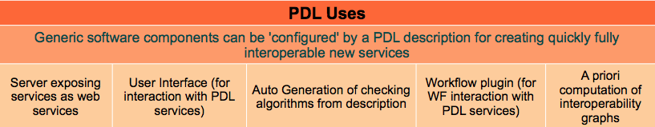
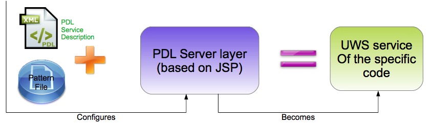
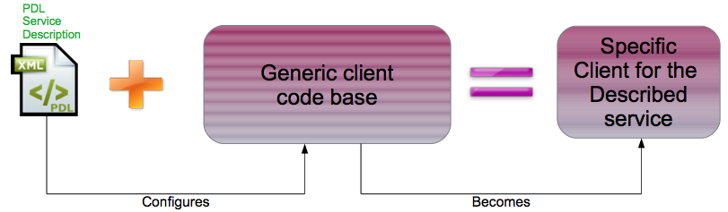
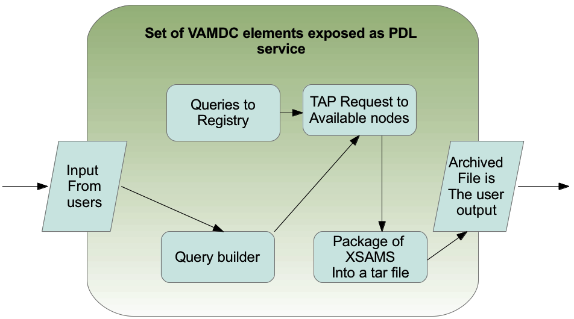
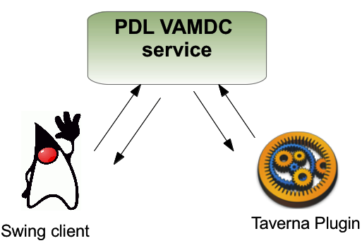

.. _vamdc-and-pdl

VAMDC and PDL co-integration
============================

A brief introduction to PDL
---------------------------

The **Parameter Description Language** (PDL) is intended to be a *lingua franca* for
describing parameters:

- Describes params with a fine grained granularity
 	- Physical properties (Nature, Meaning, unit, precision,...),
 	- Computing properties (Type, Skos concept, UCD, ...),
- Also has capabilities do describe constraints on parameters 	
 	- Physical
 	- Arbitrary (including mathematical formulas).
- Not a description of parameters *values*

The PDL descriptions are typically an XML file. 

|
|
 	

|
|

   
|
    
PDL is in RFC phase for becoming an IVOA standard. Click
`here <http://www.ivoa.net/documents/PDL/>`_ for the IVOA official document.

|

VAMDC exposed as PDL service
----------------------------
Exposing VAMDC infrastructure as a PDL service allows to take advantage of PDL feature
with few efforts.

The following schema explains which VAMDC elements compose the exposed PDL service: 

   
   
The PDL description associated to this service is `here <http://lerma.obspm.fr/adass/archives/PDL-Description.xml>`_.

You can interact with this client with two tools:

- The Java Swing client (cf. Task 1);
- The Taverna Plugin (cf. Task 2).

Task 1: Running the PDL client
------------------------------
Download the client application: `client zip file <http://lerma.obspm.fr/adass/archives/PDL-client.zip>`_

Double click on the jar. The client will launch :

- Enter your e-mail.
- In the upper-left window, click on *AtomsDetail*, *MoleculesDetails*,... This permits you to browse all the available parameters. You will remark that this is the same kind of information you have to provide on the portal. 
- Choose H in the field *AtomsDetail* then click on the *Validate* button. Then click on *Run computation*.
- Check your mail and follow the link contained into the received mail.
- When the end of the job is notified, download the tar files containing the XSAMS files. 
- Repeat the three previous steps, replacing H by He as atom symbol

Task2:  Running the Taverna Plugin
----------------------------------
Dependencies for this part are not easy to install (Taverna with AstroTaverna extension).
We are going to have this part of the tutorial together. 
 
You can download the file related to the presented workflow `here <http://lerma.obspm.fr/adass/archives/vamdc.t2flow>`_

If you feel brave:

- You can download taverna Workbench from `http://www.taverna.org.uk/download/ <http://www.taverna.org.uk/download/>`_.

- You have then to install the latest version of astrotaverna plugin. You can see the general instructions to install a new plugin `here <http://dev.mygrid.org.uk/wiki/display/taverna/Installing+plugins>`_. 

- When you click on the "Find New Plugins" button, add the following link: http://wf4ever.github.io/astrotaverna/ 

Then, select astrotaverna and install it. After installing, you will have to restart taverna to be able to run the workflow. 

Task3:  Bonus, invoking the VAMDC service from the command line or from a Browser
---------------------------------------------------------------------------------
It is possible to call the service from a browser or using the command line.
This is the same mechanism used by the Swing client or the Taverna plugin. We are going to discover how it works:

- Open the PDL description associated with the VAMDC service (cf. VAMDC exposed as PDL service)
- Find into this file :
	- the content of the *ServiceId* tag. This is the first part of the url to compose
	- the name of the parameters you want to set (tag *Name*, inside the tag *Parameter*). 	The last part of the url is ?Parameter1=Value1&Parameter2=Value2.
- Use the same input as in Task1 and compose the string to copy into the browser for submitting the job
- Example: http://pdl-calc2.obspm.fr:8081/vamdc/OnlineCode?mail=your.mail.com&AtomSymbol=H.
- submit your job through a browser, or using the curl or wget unix commands. 
	
	
