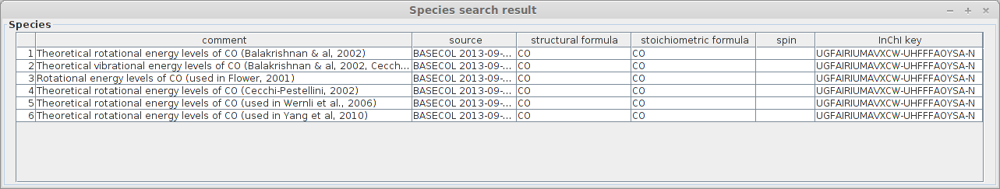
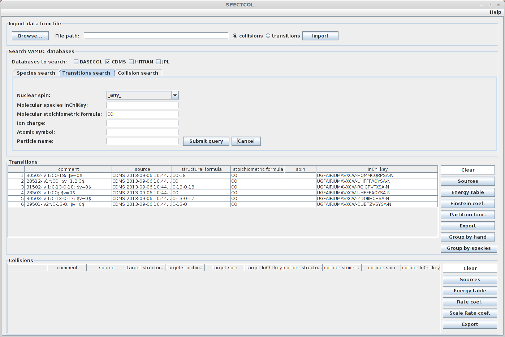
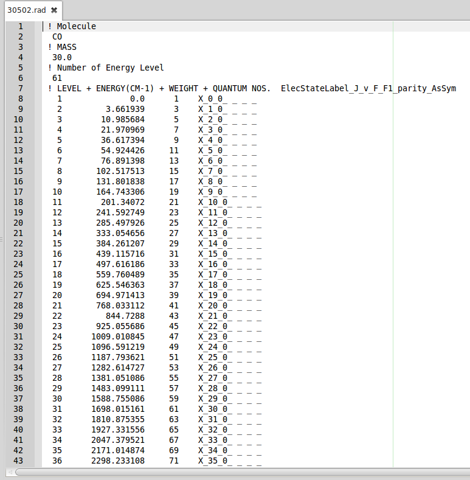
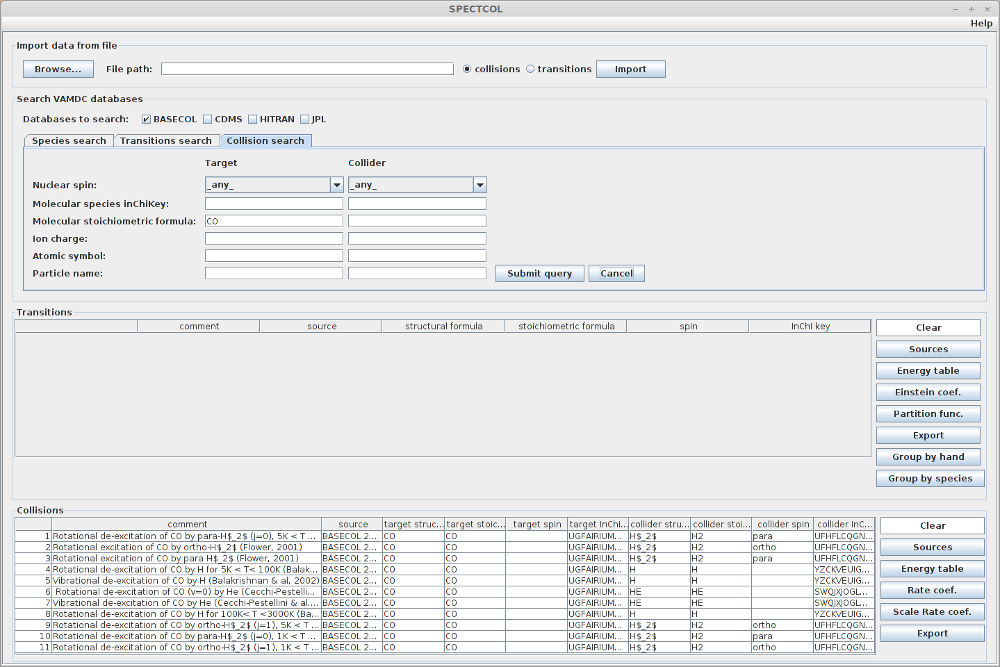
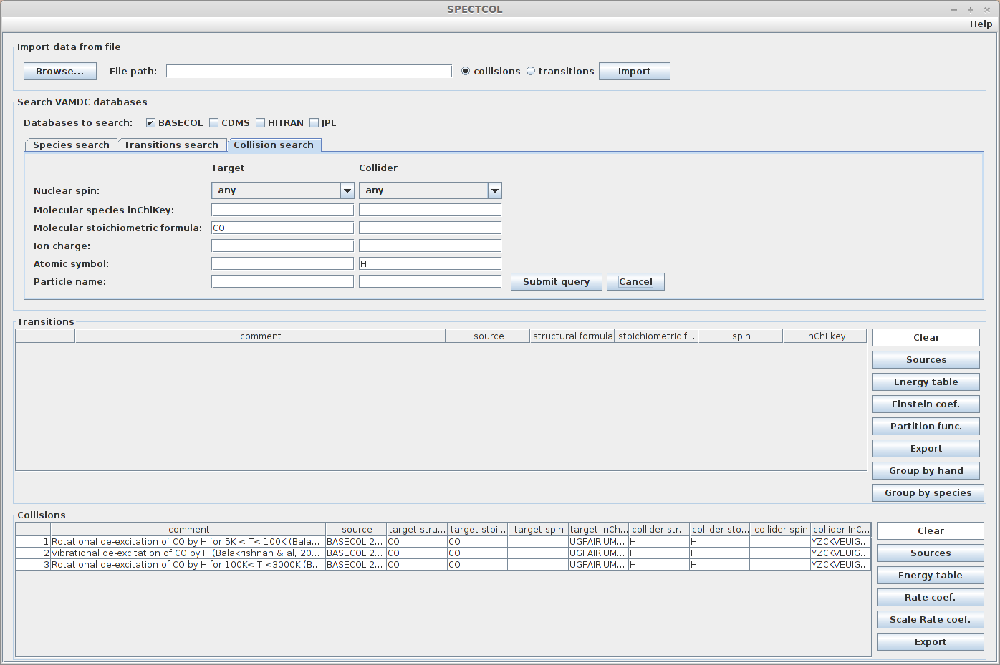
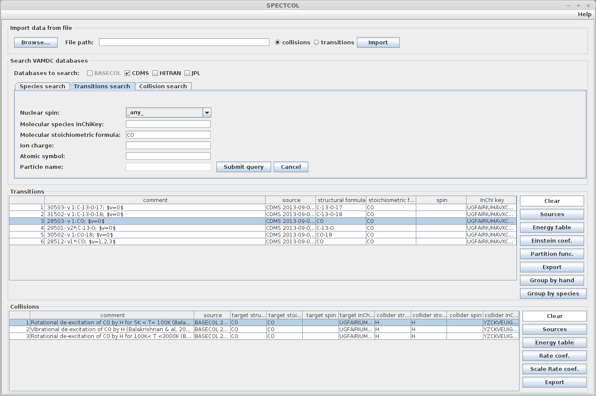
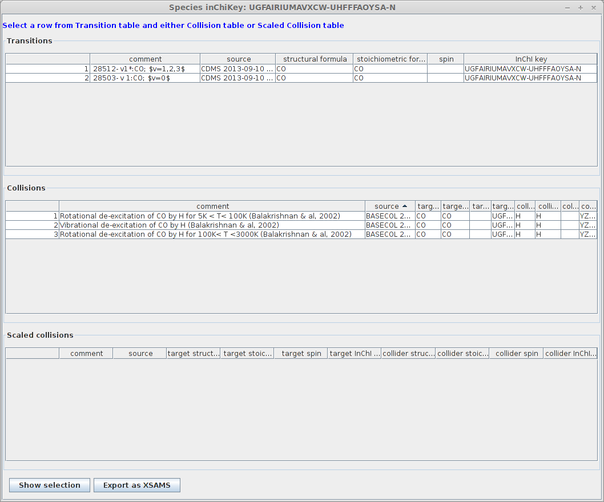
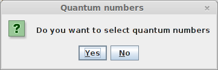
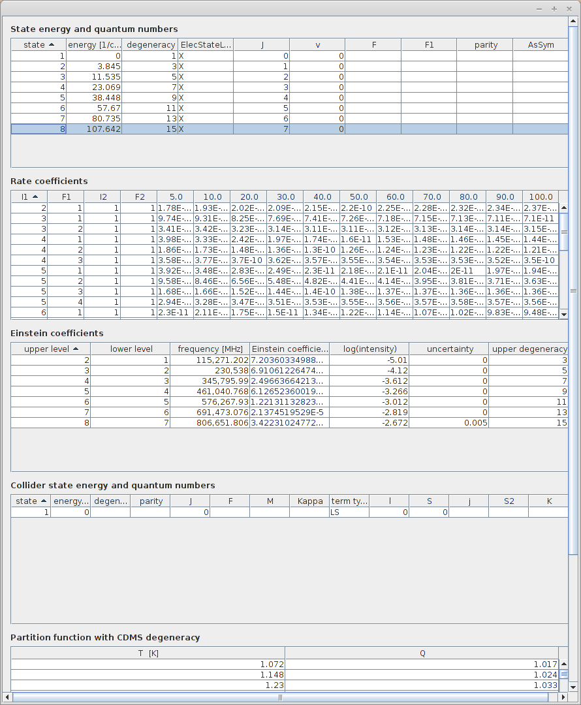

_spectcol

The SPECTCOL client tool
========================

Presentation
------------

Spectcol is a tool dedicated to handling XSAMS formatted data for the purpose of extracting and merging Einstein and rate coefficients from different sources.

Spectcol is an executable software, developed in Java language. The tool is provided with `a guide in PDF format <http://www.vamdc.eu/documents/software/SPECTCOL_guide_v12.07-r1.pdf>`_. 
The document gives a help on Spectcol's functionality and how to use it. Several versions have been developed since the beginning of the project, but the latest version is the "12.07-r1".

It can be downloaded `here <http://www.vamdc.eu/downloads/SPECTCOL-12.07-r1.jar>`_.

This application has a direct access to data from 4 databases : 

- `Basecol <http://basecol.obspm.fr>`_
- `CDMS <http://www.astro.uni-koeln.de/cdms>`_
- `JPL Molecular Spectroscopy <http://spec.jpl.nasa.gov/>`_
- `Hitran <http://www.cfa.harvard.edu/hitran/>`_

Task 1: Discovering database content
------------------------------------

When the application launches, the main window appears. For this first task we will use the "Species Search" tab, it is selected by default at startup.
It allows the user to display datasets contained in the database.

There are 6 query parameters. The only "exotic" one is the molecular species inchikey. 
The InChI identifier identifiers describes chemical substances in terms of layers of information — 
the atoms and their bond connectivity, tautomeric information, isotope information, stereochemistry, and electronic charge information.

It is human readable. The InChIKey is a 25 characters long hash of an InChI identifier and as such is not human readable. 
It is used in VAMDC species database as an unique identifier for species.

Let's look for available data related to the CO molecule in the Basecol database.
Verify that this database is the only checked one.  Then, in the Molecular Stoichiometric Formula field, seize "CO".

**Expected result:**

   
Task 2 : Transitions search
---------------------------

In this task we will look for transitional data. Click on the "Transitions search" tab.
You will notice that the Basecol database is no longer available because it only contains collisional data.

Once again we will look for data available for the CO molecule. Check the CDMS database and indicate "CO" as stoichiometric formula.
Submit query (and wait for a little while as it can take some time).

**Expected Result:**

    
All the available datasets appeared in the table. Thanks to the buttons on the right, it is possible to display all the informations  related to the currently selected dataset :

- Sources (list of all publications related to those data )
- Energy tables ( list of levels )
- Einstein coefficients (list of transitions and values of einstein coefficients)
- Partition function ( values of partition function for different temperatures)

Take some time to try all those functionnalities. All those informations can be saved as csv files. Informations related to data sources can be exported as bibtex too.

Under the partition function button is the Export button. It allows the user to export the data of a dataset either as an XSAMS file or in `the RADEX format <http://www.sron.rug.nl/~vdtak/radex/#moldata>`_.
Select the data for the file labelled 30502 and export it as RADEX.

**Expected result:**

    
This file can directly be used in `the Radex program <http://www.sron.rug.nl/~vdtak/radex/>`_ in order to calculate line intensities in interstellar clouds in LTE conditions.

Task 3 : Collisions search
---------------------------

We are now back to the "Search VAMDC Databases" area and we will look for collisional data. Click on the "Collision search" tab.
The only checked database should be Basecol. The other ones are not available.

To find a dataset, you can specify criteria on both the target and the collider of the collision. We will look for CO data so that we will be able to combine results with transitional data later.

For now, let's look at all the data available. Simply seize "CO" in the "Molecular stoichiometric formula" field. 

**Expected result :**

    
We can do a more precise request, by specifying the colliding species. For example we could look for data implying a CO+H collision. 
Enter "H" in the Atomic symbol field. There should only be 3 available collisions.

**Expected result :**

Once again, for each dataset, it is possible to display and export as a csv file the data the contain : 
    
    - Sources
    - Energy table of both target and collider
    - Rate coefficients
    - Whole file as XSAMS file 
    
Task 4 : Grouping data
----------------------

Before starting this task, use the "Clear" button to delete all results in the Transitions and Collisions  lists.

A very convenient features of this application is the possibility to merge data from Basecol and from a transitional database.
The software will identify equivalent levels in energy tables according to their quantum numbers. 
Then it will produce a table containing levels exisiting in both tables, using ernergy values from the transitional database.
Finally, it will give rate and Einstein coefficients for the levels available after merging the tables. 

The first thing to do is looking for CO data available in transitional databases. We did that in task 2. Secondly, we have to look for CO+H collisions, as we did in task 3.

**Expected result :**

The "Group by hand" and "Group by species" buttons can be used for merging. The former will let the user choose manually which datasets he wants to merge. The latter will search in the collision datasets
the ones whose collider corresponds to the currently selected transitions dataset.

The link between species will be performed thanks to the InChIKey value.

Click on the transitions dataset labelled "29501", then click on "Group by species". A window will appear with no corresponding collisional set. Indeed none of them uses the same InChIKey, which means it is 
a different CO isotope.

Now select the dataset labelled 28503. There are now 3 corresponding datasets.

**Expected result :**

    
You will notice that all the transitional datasets with a similar InChIKey have been selected as well.

Now we can merge data. You have to select one transitional and one collisional dataset and click on "Show selection". 
We will use the dataset labelled 28503 in CDMS, with v=0. These rotational data corresponds to those found in the Basecol datasets labelled "Rotational de-excitation of  CO by H".
The merging can be made on one among the three Basecol datasets.

A window will ask you if you want to choose the quantum numbers.

    
If you choose "Yes", you will be able to choose manually which quantum numbers will be used to identify similar levels in each table. If you choose "No", the choice will be made
automatically by the software according to the quantum numbers available in both tables.

Let's choose "Yes". A new window will show the energy tables. You can click on one or several columns to choose the quantum numbers. Here we will choose the rotational quantum number J.

The result is a new energy table containing levels available in both original tables. All related informations are provided too (Einstein and rate coefficients, sources, partition function values).
You have multiple export functionnalities so that you can use those merged data easily.

**Expected result :**

