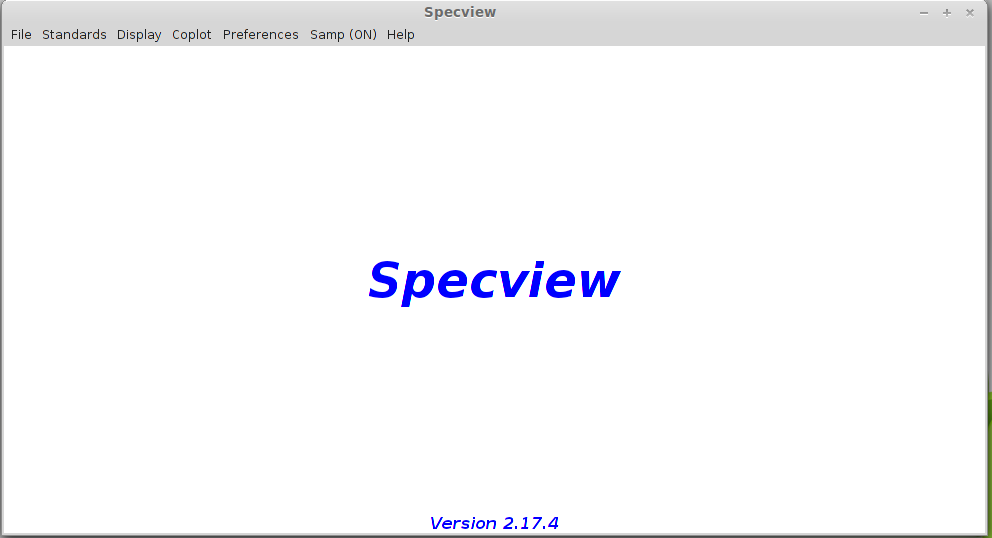
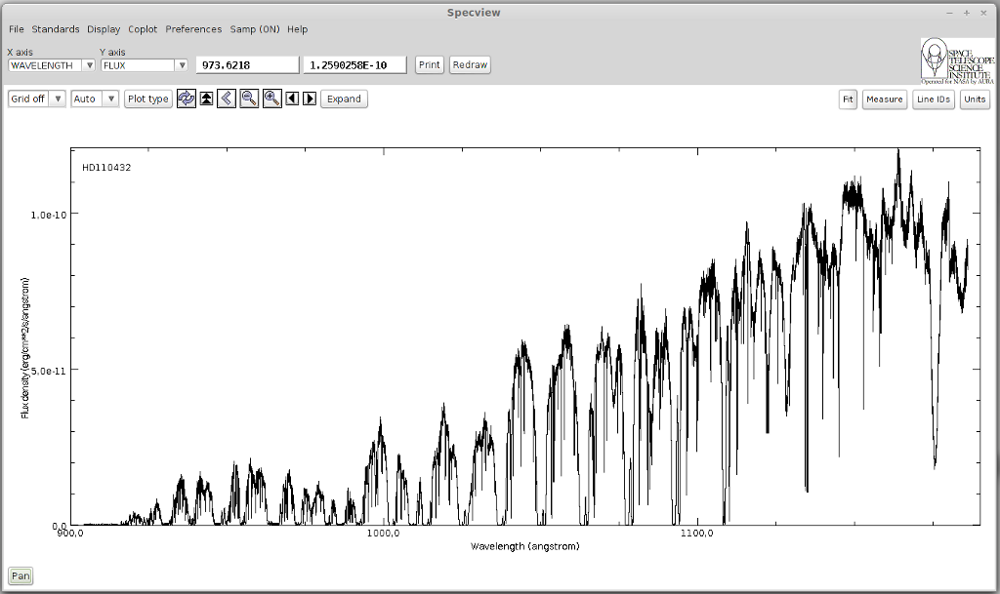
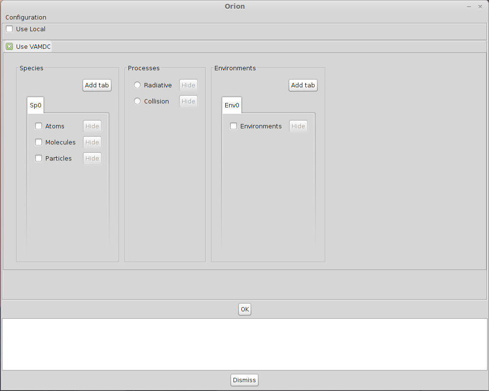
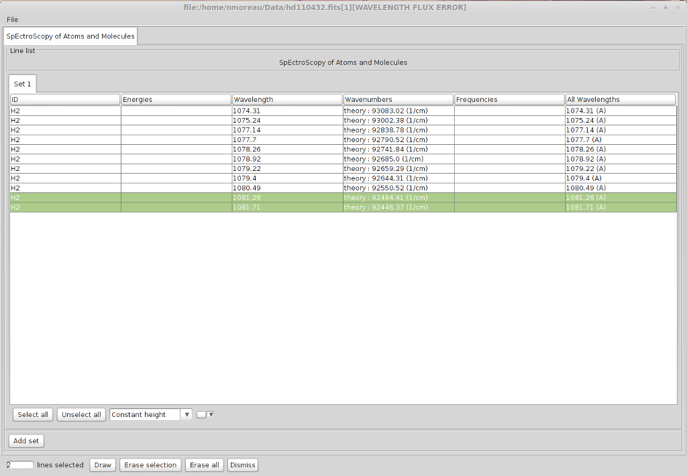
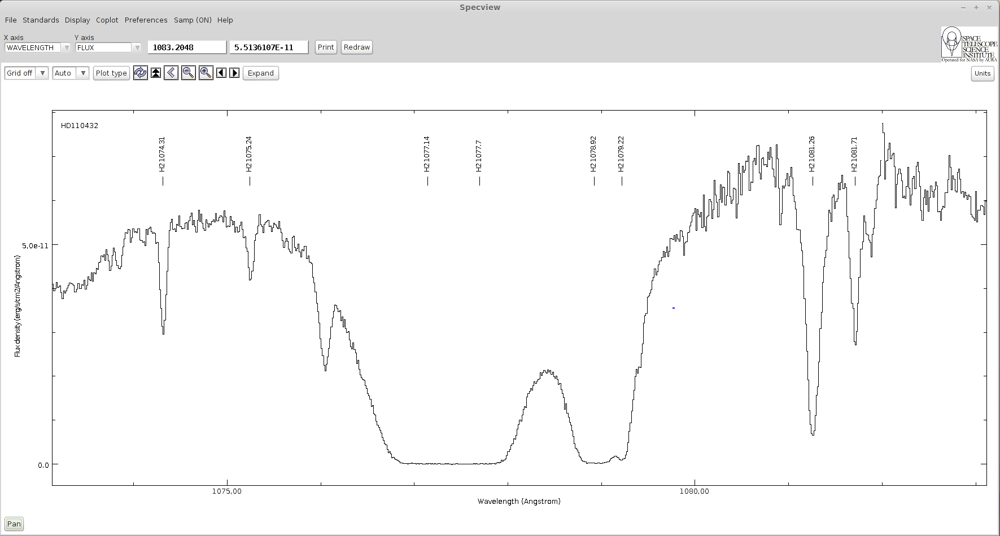

_specview

========
Specview
========

What is Specview?
=================

Presentation
------------

Specview is a tool for 1-D spectral visualization and analysis of astronomical spectra. 
It is written in Java thus can be run anywhere Java is supported. 
Specview is capable of reading all the Hubble Space Telescope spectral data formats, as well as data from several other instruments (such as IUE, FUSE, ISO, FORS and SDSS), 
preview spectra from MAST, and data from generic FITS and ASCII tables.
It can also read data from Virtual Observatory servers, and read and write spectrogram data in Virtual Observatory SED format. 
It can also read files in the SPC Galactic format used in the chemistry field.

The complete list of supported spectra is available `here <http://specview.stsci.edu/javahelp/Ingest.html#Supported_file_formats>`_

Installation
------------

The application is available for the following operating systems :

- `OSX <http://specview.stsci.edu/download/spv_macos_2_17_4.dmg>`_
- `Linux/Unix <http://specview.stsci.edu/download/spv_unix_2_17_4.sh>`_
- `Windows <http://specview.stsci.edu/download/spv_windows_2_17_4.exe>`_

Once you have downloaded and installed the application, launch it and the main window will appear :

A network connection is required for the following tutorial to work.

Using Specview
==============

Tutorial description
--------------------

In this tutorial, we will learn how to identify lines in Specview using the VAMDC infrastructure. 
The example is about the identification of absorption lines produced by diffuse interstellar clouds on the line of sight towards a bright Be Star. 

Looking for a spectrum using Simple Spectra Access (SSA)
--------------------------------------------------------

Open the File-> Read for VO Menu.

Look for `FUSE <http://archive.stsci.edu/fuse/>`_ spectra available for HD 110432 (use the service providing UV and EUV data), find and open the spectrum.
You will have to use the name resolver to find the object position (either the `SIMBAD <http://simbad.u-strasbg.fr/simbad/>`_ CADC or ESO one).

There are 2 FUSE services, we will look for data into thone whose description is "Far Ultraviolet Spectroscopic Explorer (#EUV#UV#)"
There should be only one available spectrum, below is the result you should get :

Looking for available lines
--------------------------------------------------------

Once the spectrum has been loaded, zoom on the area between 1073 and 1083 Angstroms. We will work on 2 H2 absorption lines whose positions are 1074.3 and 1081.26 Angstroms respectively.

Click the "Line IDs" button to open the search interface. 
Here there you can either look for data in local files contained in a Specview directory. Or you can 
search in databases that implemented `VAMDC standards <http://www.vamdc.eu/documents/standards/#data-access-protocol-query-language-and-dictionaries>`_ to expose their data.

We will only use VAMDC data in this tutorial so you can deselect the "Use local" checkbox.

You must now configure the data sources in which you want to look for data. Click on the configuration button in the upper left corner of the window.

Here you will find a complete list of all the databases available in the VAMDC architecture. 
We are studying a FUSE spectrum showing strong H2 absorption lines in the far UV due to a diffuse interstellar cloud between the star HD 110432 and us. 
So we want to select a database containing H2 lines in the far UV. Sesam provides these lines.
Select the database called "Spectroscopy of Atoms and Molecules" (`Sesam <http://sesam.obspm.fr>`_). 
The choice you have made in this window will be saved so the next time you launch Specview, you won't have to configure it again.

Look for data available for H2 with a wavelength between 1073 and 1075 Angstroms.There are a lot of available lines in this interval. 

.. image:: specview-images/lines.png

However it is possible to get something more precise by specifying a value for the lower level energy.
In diffuse interstellar clouds, excepted on specific conditions, the temperature is relatively cool (60 K) so most of the H2 is in its first ro-vibrationnal levels. 
We are going to select only line from levels lower or equal to v=0 J=7. We can restrict our research to a temperature below 6000K, which leads to a lower level energy between 0 and 4000 cm-1.

Do the same request with a lower level energy comprised in this interval.

Now the lines we were looking for are way easier to find. Most of the lines we found in Sesam corresponds exactly to absorption lines on the spectrum.
You can notice a total absorption between 1076.9 and 1077.7 Angstroms and between 1078.84 and 1079.2 Angstroms indicating that numerous transitions occurs at those wavelength.

The information concerning the quantum numbers of the levels are not yet available in Specview. But you can look for those transitions on the `Sesam website <http://sesam.obspm.fr>`_.

Once everything has been plotted, you should get the following spectrum : 

Here is the list of identified levels : 

+------------+-------------+-----------------------+
|Lower Level | Upper Level | Wavelength (Angstroms)|
+============+=============+=======================+
| X v=0 J=4  |  B v=3 J=3  |        1074.31        |
+------------+-------------+-----------------------+
| X v=0 J=5  |  B v=3 J=6  |        1075.24        |
+------------+-------------+-----------------------+
| X v=0 J=0  |  B v=2 J=1  |        1077.14        |
+------------+-------------+-----------------------+
| X v=0 J=1  |  B v=2 J=2  |        1077.70        |
+------------+-------------+-----------------------+
| X v=0 J=1  |  B v=2 J=0  |        1078.92        |
+------------+-------------+-----------------------+
| X v=0 J=2  |  B v=2 J=3  |        1079.22        |
+------------+-------------+-----------------------+
| X v=0 J=2  |  B v=2 J=1  |        1081.26        |
+------------+-------------+-----------------------+
| X v=0 J=3  |  B v=2 J=4  |        1081.71        |
+------------+-------------+-----------------------+

Using Simple Application Messaging Protocol in Specview
=======================================================

What is Samp
------------

SAMP, the Simple Application Messaging Protocol, is a standard for allowing software tools to exchange control and data information, 
thus facilitating tool interoperability, and so allowing users to treat separately developed applications as an integrated suite. 
An example of an operation that SAMP might facilitate is passing a source catalogue from one GUI application to another, 
and subsequently allowing sources marked by the user in one of those applications to be visible as such in the other.

To exchange data between applications with Samp, a hub is required. A hub is a process that will listen to Samp messages sent by all the Samp enabled applications 
and redirect them to the correct target.

Using Samp in Specview 
----------------------

During this tutorial we will look for a spectrum on a website and send it to Specview using the Samp protocol.
The spectrum will be find on the `Auroral Planetary Imaging and Spectroscopy website <http://lesia.obspm.fr/apis/>`_ (APIS).
This database contains various types of data derived from spectro-imaging auroral observations of the outer planets (Jupiter, Saturn and Uranus) acquired by the Hubble Space Telescope in the Far-UV.

To look for data in the APIs database, a login and a password are necessary. They will be provided during the session.

Click on "Search for data" and enter the login/password. You will arrive on this page : 

.. image:: specview-images/apis.png

Here, look for available spectroscopic data for Jupiter. You will get a list of observations. For each one there will be either an image, that you can send to `Aladin <http://aladin.u-strasbg.fr/>`_ and a spectrum
that you can send to Specview.

When Specview is started, a Samp Hub is automatically launched if none is currently running. If there is already one, it will simply connect to it.

Let's choose the following observation : 

- Target : Jupiter
- Start date : 1997-07-04
- Start time : 09:31:47
- Int. time : 700.19613 s
- Instrument : HST / STIS
- Obs. type: SPECTROSCOPIC
- Grating / slit :  G140L / 52X0.5
- Dataset : o43ba2h4q

Click on "Display with Specview" under the original data. A message will ask you to authorize the connection, choose "Yes".
The following window will appear : 

.. image::  specview-images/apis_samp_window.png

Click on the "Go" button on the "All lines" line. You will get the following spectrum : 

.. image:: specview-images/apis_jupiter.png

