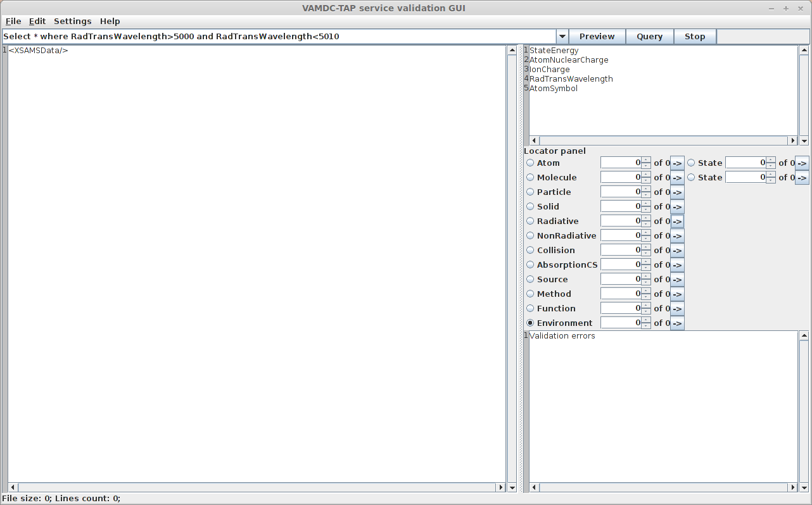
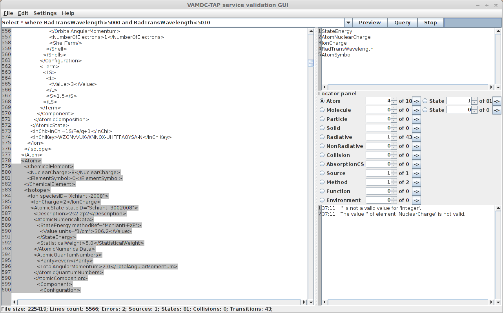
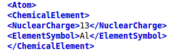
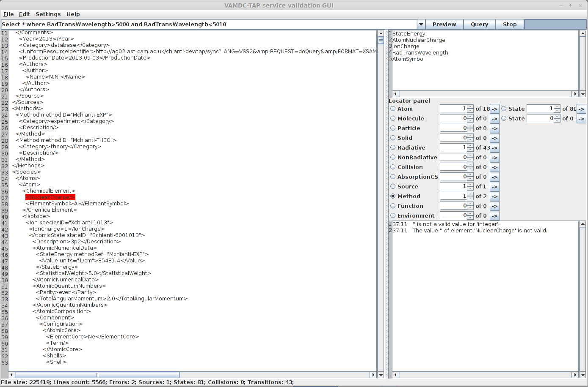
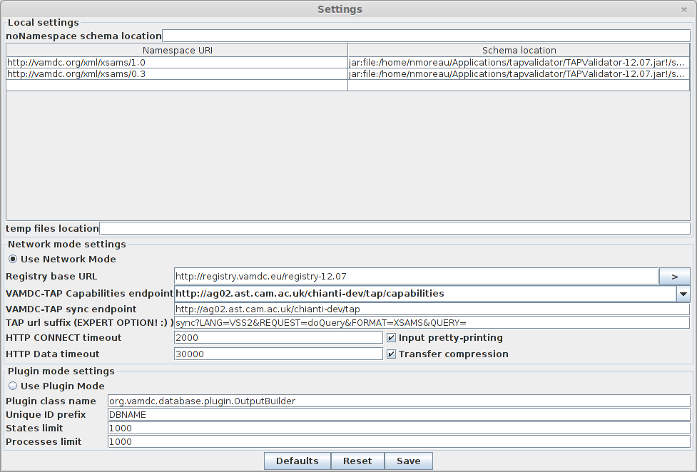
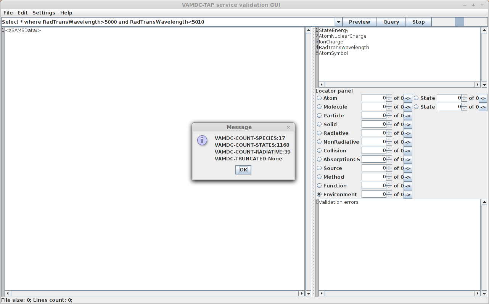

_xsams

The XSAMS file format and TAP Validator application
===================================================

Task 1: Find some spectroscopic data
------------------------------------

In this task we will reuse the XSAMS file got from `this exercise <http://lerma.obspm.fr/vamdc-tutorial/portal/first-steps-with-portal.html#task-3-find-some-spectroscopic-data>`_.

It contains spectroscopic data from the Chianti databases for transitions whose wavelength is between 5000 and 5010 Angstroms.

If you do not have this file anymore, you can either do the previous activity again or simply `get it from here <http://lerma.obspm.fr/vamdc-tutorial/archives/chianti.xsams>`_.

Task 2: Starting the Tap Validator tool
---------------------------------------

The first thing to do is to `download the application <http://www.vamdc.eu/downloads/TAPValidator-12.07.jar>`_. This is a simple jar file.

Then, according to your OS, you can launch it either by double clicking the jar file or by using the following command : 
|
java -jar TAPValidator-12.07.jar

The following window will appear :

  
This tool's main purpose is to check that a VAMDC node returns data that are valid when checked against the XSAMS XML schema.
It can also conveniently be used to check that a simple XSAMS file is valid and show you what is wrong if this is not the case.

Task 3: Checking an XSAMS document
----------------------------------

In the program window, choose "File->Open" and open the file you saved previously. You can now navigate into it.

Look at the Locator Panel on the right. 
It shows the content of the document. Then you can navigate into it. For example you can check what is the 4th Atom in the list :

As you can see, no warning nor error appears in the text area under the Locator Panel, which means that the document is valid.

We will now see what happens if it is not the case.

Open the document with a text editor. Then find the first occurrence of the <NuclearCharge> markup. 

Remove the nuclear charge value and let it empty. Reload the file in the validator. The field you just modified is mandatory. Consequently, an error will be shown in the text area.
By clicking on the text you will be shown the exact location where the problem lies.

Task 4 : Checking a VAMDC Node
------------------------------

The main purpose of this application is to check that the output of a node is a valid XSAMS document.
Let's configure the application so that we can test a node. 

We will query the Chianti node and reproduce the request we did in task 1. 

Click on "Settings->Configure", then enter the following informations. You have to modify only two fields :
VAMDC-TAP Capabilities endpoint : http://ag02.ast.cam.ac.uk/chianti-dev/tap/capabilities
VAMDC-TAP sync endpoint : http://ag02.ast.cam.ac.uk/chianti-dev/tap

Those are informations you can find in the registry. 

**Expected result**: the configuration window should looks like this:

Verify carefully that the registry URL is correct. There are two distinct registries. 
One containing older versions of the nodes (11.12), the other containing the current production nodes (12.07).

Finally, click on the "Save" button. 

At the top of the main window is a textfield where you can seize a request to send to the VAMDC node. 
We will use the following request : 
**Select * where RadTransWavelength>5000 and RadTransWavelength<5010**

Click the "Preview" button. A window will appear, showing statistics about the results (how many states, transitions, species ...) but actual data are not downloaded.

Now if you close this window and click on the query button, the request will be executed and the XSAMS file will appear in the main text area.
Finally, you can save this file locally (File->Save) or simply save the statistics concerning this request as an xml document (File->Save Report) 
